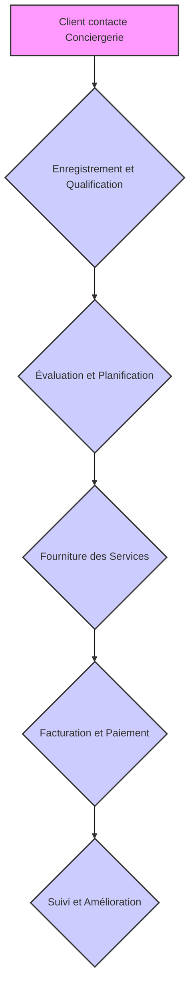

## Processus Métier de la Conciergerie Médicale

| Tags |
|------|
| `processus métier` `conciergerie médicale` `santé` |

Le présent document décrit le processus métier de la conciergerie médicale.

### 1. Prise de contact et qualification de la demande

Le processus débute par la prise de contact avec le client. Cette étape inclut :

*   **Identification du besoin :** Le client exprime sa demande (prise de rendez-vous, recherche de spécialistes, suivi administratif...).
*   **Qualification de la demande :** Le concierge analyse la demande, vérifie l'éligibilité du client et s'assure de la faisabilité.

### 2. Recherche et sélection de prestataires

Cette étape consiste à :

*   **Recherche de prestataires :** Le concierge recherche les prestataires adaptés (médecins, cliniques, laboratoires...) en fonction des besoins du client et des critères définis.
*   **Sélection des prestataires :** Le concierge sélectionne les prestataires en se basant sur des critères de qualité, de disponibilité, de localisation et de tarification.

### 3. Planification et organisation

Cette phase comprend :

*   **Prise de rendez-vous :** Le concierge prend rendez-vous avec le prestataire sélectionné, en tenant compte des disponibilités du client et du prestataire.
*   **Organisation logistique :** Le concierge organise si nécessaire le transport, l'hébergement ou tout autre service complémentaire.

### 4. Suivi et accompagnement

Le suivi est assuré par :

*   **Confirmation et rappel :** Le concierge confirme les rendez-vous et effectue des rappels au client.
*   **Accompagnement (si nécessaire) :** Le concierge peut accompagner le client lors de ses rendez-vous médicaux.
*   **Suivi administratif :** Le concierge gère les documents administratifs (feuilles de soins, demandes de remboursement...).

### 5. Facturation et reporting

Cette étape inclut :

*   **Facturation :** Le concierge établit les factures correspondantes aux services rendus.
*   **Reporting :** Le concierge génère des rapports d'activité et analyse les données pour améliorer la qualité du service.

### Exemple de code (non exhaustif)

```python
def prendre_rdv(client, specialiste, date, heure):
    """
    Fonction pour prendre un rendez-vous.
    """
    try:
        # Logique pour contacter le spécialiste et prendre le rendez-vous
        print(f"Rendez-vous pris pour {client} avec {specialiste} le {date} à {heure}")
        return True
    except Exception as e:
        print(f"Erreur lors de la prise de rendez-vous: {e}")
        return False
```

### 6. Flux de communication

Le flux de communication s'articule autour des points suivants :

*   **Client - Concierge :** Communication régulière par téléphone, email ([EMAIL]) ou via une plateforme dédiée.
*   **Concierge - Prestataires :** Communication pour la prise de rendez-vous, la coordination des services et le suivi.
*   **Concierge - Equipe interne :** Communication pour la répartition des tâches et la gestion des dossiers.

### 7. Aspects sécurité et confidentialité

La sécurité et la confidentialité des données sont primordiales :

*   **Protection des données personnelles :** Respect du RGPD et mise en place de mesures de sécurité pour protéger les données clients.
*   **Confidentialité des informations médicales :** Le concierge est tenu au secret professionnel.
*   **Sécurité des infrastructures :** Utilisation de serveurs sécurisés et de protocoles de communication chiffrés.
*   **Gestion des accès :** Contrôle rigoureux des accès aux données et aux systèmes.

### 8. Aspects légaux et réglementaires

Le respect des obligations légales est essentiel :

*   **Conformité réglementaire :** Respect des réglementations en vigueur concernant la protection des données, la santé et les assurances.
*   **Assurance responsabilité civile professionnelle :** Souscription d'une assurance pour couvrir les éventuels dommages causés par l'activité de conciergerie.

### 9. Technologies utilisées (exemple)

*   **CRM (Customer Relationship Management) :** Pour la gestion des clients et des dossiers.
*   **Plateformes de communication :** Téléphonie, email, messagerie sécurisée.
*   **Outils de planification :** Pour la gestion des rendez-vous et des agendas.
*   **Logiciels de facturation :** Pour la gestion des factures et des paiements.

### 10. Amélioration continue

Le processus est soumis à une démarche d'amélioration continue :

*   **Recueil des feedbacks clients :** Pour évaluer la satisfaction et identifier les points d'amélioration.
*   **Analyse des indicateurs de performance :** Pour mesurer l'efficacité des actions et optimiser les processus.
*   **Veille technologique et réglementaire :** Pour anticiper les évolutions et s'adapter aux changements.
*   **Formation continue des équipes :** Pour maintenir et développer les compétences.

### 11. Contacts

Pour toute question, veuillez contacter [NOM] à [EMAIL] ou [IP].


## Processus métier d'une conciergerie médicale

| Tags |
|------|
| `conciergerie médicale` `processus métier` `téléconsultation` `spécialistes` |

Les processus métier d'une conciergerie médicale sont complexes et englobent plusieurs étapes critiques. Ces étapes visent à fournir un service personnalisé et efficace aux clients, en optimisant l'accès aux soins de santé et en simplifiant les démarches administratives.

**1. Prise de contact et enregistrement du client**

Le premier point de contact avec le client est crucial. Cela peut se faire par téléphone, email ou via un formulaire en ligne. L'objectif est de recueillir les informations essentielles :

*   Identification du client : Nom, prénom, date de naissance, coordonnées ([EMAIL], numéro de téléphone, adresse postale).
*   Informations médicales de base : Antécédents médicaux pertinents, allergies, traitements en cours.
*   Motif de la demande : Description claire et précise du besoin du client (consultation spécialisée, téléconsultation, recherche d'informations médicales, etc.).
*   Assurances et mutuelles : Récupérer les informations relatives à l'assurance santé du client pour faciliter la prise en charge des frais médicaux.

L'enregistrement du client dans le système CRM ([NOM] CRM) permet de centraliser et de sécuriser toutes les informations.  Un identifiant unique est attribué à chaque client pour un suivi personnalisé.

**2. Analyse et qualification de la demande**

Une fois la demande reçue, elle est analysée par un coordinateur médical ou un assistant spécialisé. Cette analyse comprend :

*   Compréhension approfondie du besoin : Clarification de la demande du client pour déterminer les actions à entreprendre.
*   Évaluation de l'urgence : Déterminer le niveau d'urgence de la demande pour prioriser les actions.
*   Recherche d'informations préliminaires : Compilation d'informations sur les spécialistes pertinents, les disponibilités et les tarifs.
*   Vérification des informations : Confirmation des informations de contact et des informations d'assurance.

**3. Orientation vers un spécialiste (toutes spécialités)**

Cette étape est centrale dans le fonctionnement de la conciergerie médicale.  Elle consiste à faciliter l'accès à des consultations spécialisées.  Le processus est le suivant :

*   Recherche et sélection du spécialiste : Recherche du spécialiste approprié en fonction de la spécialité requise, de la localisation géographique, des préférences du client et des recommandations médicales.  La conciergerie dispose d'un réseau de spécialistes référencés et d'outils de recherche pour identifier les professionnels de santé.
*   Prise de rendez-vous : Contact du spécialiste ou de son secrétariat pour fixer un rendez-vous adapté aux disponibilités du client. La conciergerie gère la planification des rendez-vous et s'assure de minimiser les délais d'attente.
*   Confirmation du rendez-vous : Confirmation du rendez-vous avec le client, en lui fournissant les informations nécessaires (date, heure, lieu, recommandations de préparation).
*   Préparation du client : Fournir au client des informations sur le spécialiste, le déroulement de la consultation, et les documents à apporter.  Préparation d'un dossier médical synthétique à remettre au spécialiste.
*   Suivi post-consultation : S'assurer que le client a bien reçu la consultation et, si nécessaire, l'aider à obtenir des examens complémentaires ou à prendre rendez-vous pour un suivi.

**4. Organisation des téléconsultations**

Les téléconsultations représentent une composante importante des services de la conciergerie médicale, offrant une solution pratique et accessible. Le processus est similaire à celui des consultations physiques, avec des adaptations spécifiques :

*   Sélection du prestataire de téléconsultation : Choix d'une plateforme de téléconsultation fiable et sécurisée, en fonction des besoins du client et des recommandations médicales.
*   Planification de la téléconsultation : Organisation du rendez-vous en fonction des disponibilités du client et du spécialiste.
*   Préparation technique : S'assurer que le client dispose de l'équipement nécessaire (ordinateur, webcam, microphone) et d'une connexion internet stable.  Fournir une assistance technique si nécessaire.
*   Gestion des aspects administratifs : Prise en charge des formalités administratives liées à la téléconsultation, notamment le remboursement des frais par l'assurance maladie et la mutuelle.
*   Déroulement de la téléconsultation : Accompagnement du client avant, pendant et après la téléconsultation pour garantir le bon déroulement de l'échange.
*   Suivi post-téléconsultation : S'assurer que le client a bien reçu les recommandations du médecin et l'aider à obtenir les prescriptions ou les examens complémentaires nécessaires.

**5. Gestion des dossiers médicaux et coordination des soins**

La gestion des dossiers médicaux est essentielle pour assurer la continuité des soins et la confidentialité des informations. Le processus inclut :

*   Numérisation et archivage des documents médicaux : Numérisation et archivage sécurisé des documents médicaux (comptes rendus de consultations, résultats d'examens, ordonnances).
*   Mise à jour régulière des dossiers : Mise à jour des dossiers avec les nouvelles informations médicales, les traitements en cours et les antécédents médicaux.
*   Partage des informations médicales : Partage des informations médicales avec les professionnels de santé impliqués dans la prise en charge du client, avec son consentement explicite.
*   Coordination des soins : Assurer la coordination des soins entre les différents professionnels de santé, en veillant à la cohérence des traitements et des recommandations.

**6. Gestion des aspects administratifs et financiers**

La conciergerie médicale prend en charge les aspects administratifs et financiers liés aux soins de santé, pour simplifier la vie des clients. Cela inclut :

*   Gestion des remboursements : Assistance dans les démarches de remboursement des frais médicaux auprès de l'assurance maladie et de la mutuelle.
*   Gestion des devis et des factures : Vérification des devis, gestion des factures et suivi des paiements.
*   Négociation des tarifs : Négociation des tarifs avec les professionnels de santé, si nécessaire, pour réduire les coûts.
*   Accompagnement dans les démarches administratives : Accompagnement dans les démarches administratives liées à la santé, telles que les demandes de prise en charge, les dossiers de maladie longue durée, etc.

**7. Veille et amélioration continue**

La conciergerie médicale doit constamment s'adapter et s'améliorer pour répondre aux besoins changeants des clients. Cela comprend :

*   Veille des évolutions de la législation et des recommandations médicales : Mise à jour des connaissances et des procédures pour se conformer aux réglementations en vigueur et aux meilleures pratiques médicales.
*   Évaluation de la satisfaction client : Recueil des commentaires et des suggestions des clients pour améliorer la qualité des services.
*   Formation continue du personnel : Formation continue du personnel sur les dernières avancées médicales, les technologies de la santé et les meilleures pratiques en matière de service client.
*   Mise en place d'indicateurs de performance : Suivi des indicateurs de performance (temps de réponse, taux de satisfaction client, etc.) pour évaluer l'efficacité des processus et identifier les axes d'amélioration.

**8. Sécurité et confidentialité des données**

La sécurité et la confidentialité des données des clients sont une priorité absolue.  La conciergerie médicale met en place des mesures rigoureuses pour protéger les informations personnelles et médicales.  Cela inclut :

*   Conformité au RGPD : Respect du Règlement Général sur la Protection des Données (RGPD) et des autres réglementations en matière de protection des données.
*   Sécurisation des systèmes d'information : Utilisation de systèmes d'information sécurisés avec des mesures de protection contre les accès non autorisés et les cyberattaques.
*   Chiffrement des données : Chiffrement des données sensibles, tant au repos qu'en transit, pour garantir leur confidentialité.
*   Gestion des accès : Contrôle strict des accès aux données et restriction de l'accès aux seules personnes autorisées.
*   Sensibilisation du personnel : Formation du personnel sur les règles de sécurité et de confidentialité des données.
*   Politique de confidentialité claire : Mise en place d'une politique de confidentialité claire et transparente, expliquant comment les données sont collectées, utilisées et protégées.

**9. Utilisation des technologies**

Les technologies numériques sont essentielles pour améliorer l'efficacité et la qualité des services de la conciergerie médicale. Les outils utilisés comprennent :

*   CRM (Customer Relationship Management) : Pour la gestion des clients et de leurs dossiers.
*   Logiciels de prise de rendez-vous : Pour faciliter la planification des consultations.
*   Plateformes de téléconsultation : Pour la réalisation des consultations à distance.
*   Applications mobiles : Pour permettre aux clients d'accéder facilement à leurs informations médicales et de communiquer avec la conciergerie.
*   Outils de communication sécurisée : Pour échanger des informations médicales confidentielles avec les professionnels de santé.
*   Intégration d'outils d'intelligence artificielle :  Pour l'analyse des données de santé et l'aide à la décision.

**10. Gestion des urgences**

La conciergerie médicale doit être capable de gérer les situations d'urgence avec rapidité et efficacité. Cela inclut :

*   Évaluation de l'urgence : Évaluation rapide de la situation pour déterminer le niveau de gravité.
*   Orientation vers les services d'urgence : Orientation rapide du client vers les services d'urgence appropriés, si nécessaire.
*   Coordination avec les services d'urgence : Coordination avec les services d'urgence pour faciliter la prise en charge du client.
*   Suivi du client : Suivi du client après une urgence pour s'assurer de sa bonne prise en charge et de son rétablissement.
*   Mise en place d'un protocole d'urgence : Établissement d'un protocole d'urgence clair et précis, décrivant les actions à entreprendre en cas d'urgence.

next


## Résolution des problèmes de connectivité réseau

| Tags |
|------|
| `réseau` `dépannage` `TCP/IP` |

Pour résoudre les problèmes de connectivité réseau, suivez ces étapes :

1.  **Vérification de la connectivité de base :**

    *   Vérifiez les connexions physiques du réseau (câbles, routeurs, commutateurs).
    *   Vérifiez que l'adresse IP, le masque de sous-réseau, la passerelle par défaut et les serveurs DNS sont correctement configurés.

2.  **Utilisation des outils de diagnostic :**

    *   **Ping :** Utilisez la commande `ping [IP]` ou `ping [NOM]` pour tester la connectivité de base. Exemple :

        ```bash
        ping [IP]
        ```

    *   **Traceroute/Tracer :** Utilisez `traceroute [IP]` (Linux/macOS) ou `tracert [IP]` (Windows) pour identifier le chemin réseau et les éventuels points de défaillance.

        ```bash
        traceroute [IP]
        ```

    *   **Nslookup/dig :** Utilisez `nslookup [NOM]` ou `dig [NOM]` pour vérifier la résolution DNS.

        ```bash
        nslookup [NOM]
        ```

3.  **Vérification des paramètres du pare-feu :**

    *   Assurez-vous que le pare-feu n'est pas en train de bloquer le trafic réseau nécessaire.
    *   Vérifiez les règles du pare-feu et les exceptions.

4.  **Dépannage avancé :**

    *   **Capture de paquets :** Utilisez des outils comme Wireshark pour analyser le trafic réseau et identifier les problèmes de communication.
    *   **Analyse des logs :** Examinez les journaux système et les journaux des applications pour identifier les erreurs et les avertissements liés au réseau.
    *   **Test de vitesse :** Utilisez des outils de test de vitesse pour vérifier la performance de la connexion Internet.

5.  **Exemples de commandes et d'outils :**

    *   **Netstat :** Affiche les connexions réseau actives, les ports en écoute et les statistiques réseau.

        ```bash
        netstat -a
        ```

    *   **Ipconfig (Windows) / Ifconfig (Linux/macOS) :** Affiche la configuration réseau de l'interface.

        ```bash
        ipconfig /all
        ```

        ```bash
        ifconfig -a
        ```

6.  **Conseils supplémentaires :**

    *   Redémarrez les appareils réseau (routeurs, commutateurs).
    *   Mettez à jour les pilotes de la carte réseau.
    *   Contactez votre fournisseur d'accès Internet ([FAI]) si le problème persiste.

7.  **Contact :**

    *   Pour toute question, contactez [NOM] à [EMAIL] ou [IP].


## Processus Métier de la Conciergerie Médicale

| Tags |
|------|
| `conciergerie médicale` `processus métier` `flux de travail` |

Le processus métier de la conciergerie médicale décrit les étapes et les flux de travail impliqués dans la fourniture de services de conciergerie médicale. Ce processus est essentiel pour assurer une prestation de services efficace et centrée sur le patient.

**1. Enregistrement et Qualification du Client**

*   Le client contacte [NOM] via téléphone, e-mail ([EMAIL]), ou formulaire en ligne.
*   L'équipe de conciergerie recueille les informations préliminaires :
    *   Informations personnelles : nom, coordonnées ([EMAIL], téléphone, adresse).
    *   Informations médicales de base (antécédents, allergies).
    *   Nature de la demande ou du besoin.
*   Qualification de la demande pour déterminer la pertinence et la faisabilité.

**2. Évaluation et Planification des Besoins**

*   Analyse approfondie de la demande du client.
*   Définition des objectifs et des priorités.
*   Élaboration d'un plan d'action personnalisé, incluant :
    *   Recherche et sélection de professionnels de santé (médecins, spécialistes, etc.).
    *   Prise de rendez-vous et coordination des consultations.
    *   Organisation des examens médicaux et des analyses.

**3. Fourniture des Services et Accompagnement**

*   Mise en œuvre du plan d'action :
    *   Communication constante avec le client.
    *   Gestion des rendez-vous et des déplacements.
    *   Accompagnement physique ou téléphonique lors des consultations.
*   Suivi des traitements et des recommandations médicales.
*   Gestion des documents médicaux et des rapports.

**4. Facturation et Paiement**

*   Émission des factures détaillées des services fournis.
*   Gestion des paiements et suivi des règlements.

**5. Suivi et Amélioration Continue**

*   Collecte des retours d'expérience et des évaluations des clients.
*   Analyse des performances du processus.
*   Mise en place d'améliorations pour optimiser l'efficacité et la qualité des services.
*   Mise en place d'une veille sur les nouvelles technologies et les évolutions réglementaires.

**Exemple de flux de travail simplifié :**



**Sécurité et Confidentialité**

*   Protection des données personnelles des clients conformément aux réglementations en vigueur (RGPD).
*   Utilisation de protocoles de sécurité pour protéger les informations sensibles.
*   Accès contrôlé aux données et aux documents médicaux.

**Aspects Technologiques**

*   Utilisation d'un système de gestion de la relation client (CRM) pour gérer les interactions.
*   Plateforme de communication sécurisée pour échanger des informations avec les clients et les professionnels de santé.
*   Outils de gestion de planning et de prise de rendez-vous.

**Responsabilités**

*   [NOM] est responsable de la gestion du processus de conciergerie médicale.
*   [NOM] est responsable de la qualité des services fournis.
*   [NOM] est responsable du respect de la confidentialité des données.

**Contact**

Pour toute question ou demande d'information, veuillez contacter [NOM] à [EMAIL] ou au [NUMÉRO DE TÉLÉPHONE].
L'adresse IP est : [IP].


## Conciergerie Médicale : Présentation

| Tags |
|------|
| `santé` `service personnalisé` `médecine` |

Une conciergerie médicale est un service spécialisé qui offre à ses membres un accès privilégié et personnalisé aux soins de santé. Elle vise à simplifier l'accès aux services médicaux, à coordonner les soins et à répondre aux besoins spécifiques de chaque patient. La conciergerie médicale joue le rôle d'intermédiaire entre les patients et les professionnels de la santé, garantissant ainsi une expérience fluide.


## Comprendre la Conciergerie Médicale

| Tags |
|------|
| `conciergerie médicale` `santé` `services` |


## Définition et Mission de la Conciergerie Médicale

| Tags |
|------|
| `conciergerie médicale` `soins de santé` `accompagnement patient` |

La conciergerie médicale se caractérise par une approche axée sur le patient, proposant un accompagnement personnalisé dans le parcours de soins. Sa mission première consiste à faciliter l'accès rapide et sur mesure aux services médicaux, en minimisant les délais d'attente et en simplifiant les procédures administratives.


## Structure organisationnelle de la conciergerie médicale

| Tags |
|------|
| `conciergerie médicale` `organisation` `équipe` |

La conciergerie médicale s'appuie sur une équipe multidisciplinaire incluant des conseillers médicaux, des coordinateurs de soins et des professionnels de la santé. Chaque membre est essentiel pour gérer les demandes des patients et coordonner les soins.


## Services d'une conciergerie médicale

| Tags |
|------|
| `conciergerie médicale` `services` `santé` |

Les services offerts par une conciergerie médicale incluent :

*   Prise de rendez-vous avec des spécialistes.
*   Organisation de téléconsultations.
*   Coordination des soins post-consultation.
*   Accompagnement administratif (gestion des dossiers médicaux, remboursement).
*   Accès à un réseau étendu de professionnels de santé.


## Processus de Prise en Charge des Demandes de Spécialistes

| Tags |
|------|
| `processus` `demandes` `spécialistes` |


## Identification des besoins du patient

| Tags |
|------|
| `santé` `diagnostic` `médical` |

Lorsqu'un patient sollicite la conciergerie pour une consultation spécialisée, l'identification précise de ses besoins médicaux est primordiale. Cette étape inclut :

*   Un entretien préliminaire visant à déterminer les symptômes et les antécédents médicaux du patient.
*   L'analyse des documents médicaux existants, tels que les rapports médicaux, les examens d'imagerie et les prescriptions.


## Sélection du spécialiste

| Tags |
|------|
| `médecine` `spécialiste` `base de données` |

Sur la base de l'évaluation initiale, le conseiller médical sélectionne le spécialiste le plus approprié :

*   Consultation de la base de données interne pour identifier les spécialistes disponibles.
*   Évaluation des qualifications et de l'expérience des spécialistes.
*   Vérification de la compatibilité avec les besoins spécifiques du patient (langue parlée, proximité géographique, disponibilité).


## Prise de rendez-vous avec le spécialiste

| Tags |
|------|
| `prise de rendez-vous` `gestion rendez-vous` `communication patient` |

Une fois le spécialiste sélectionné, la conciergerie organise la prise de rendez-vous :

*   Coordination avec le cabinet du spécialiste pour fixer une date et une heure convenables.
*   Confirmation du rendez-vous au patient par téléphone ou email.
*   Envoi de rappels et de toutes les informations nécessaires pour le rendez-vous (adresse, documents à apporter).


## Suivi Post-Consultation

| Tags |
|------|
| `Suivi patient` `Soins de santé` `Coordination` |

Après la consultation, la conciergerie met en place un suivi rigoureux :

*   Recueil des comptes rendus médicaux auprès du spécialiste.
*   Explication des résultats et des prochaines étapes au patient.
*   Coordination des soins supplémentaires si nécessaire (examens complémentaires, nouvelle consultation).


## Organisation des Téléconsultations

| Tags |
|------|
| `téléconsultation` `organisation` `processus` |


## Mise en place du service de téléconsultation

| Tags |
|------|
| `téléconsultation` `plateforme sécurisée` `RGPD` |

La téléconsultation est un service essentiel de la conciergerie médicale, offrant aux patients la possibilité de consulter des professionnels de santé à distance :

*   Mise en œuvre d'une plateforme sécurisée pour les consultations en ligne.
*   Formation des professionnels de santé et des patients à l'utilisation de la plateforme.
*   Protection des données et conformité aux réglementations de confidentialité (RGPD).


## Processus de Demande de Téléconsultation

| Tags |
|------|
| `téléconsultation` `processus` `patient` |

Lorsqu'un patient souhaite une téléconsultation, le processus est le suivant :

*   Identification des besoins médicaux et des préférences du patient.
*   Sélection d'un professionnel de santé disponible pour une téléconsultation.
*   Prise de rendez-vous et envoi d'un lien sécurisé pour accéder à la consultation.


## Téléconsultation : Processus Opérationnel

| Tags |
|------|
| `téléconsultation` `processus` `médical` |

Le jour de la téléconsultation :

*   Assistance technique pour aider le patient à se connecter.
*   Déroulement de la consultation avec possibilité de partager des documents et des images médicales en temps réel.
*   Enregistrement et sauvegarde sécurisée des échanges pour le dossier médical.


## Suivi Post-Téléconsultation

| Tags |
|------|
| `téléconsultation` `suivi patient` `assistance` |

Après la téléconsultation, la conciergerie assure le suivi du patient :

*   Explication des résultats de la consultation.
*   Coordination des suivis nécessaires (prescriptions, examens complémentaires).
*   Assistance pour toute question ou problème technique lié à la téléconsultation.


## Gestion des demandes par spécialité

| Tags |
|------|
| `Gestion des demandes` `Spécialité` `Workflow` |


## Cardiologie

| Tags |
|------|
| `cardiologie` `consultation` `ECG` `échocardiographie` |

*   Prise en charge des patients nécessitant des consultations en cardiologie.
*   Organisation de tests cardiaques (ECG, échocardiographie).
*   Suivi post-consultation avec cardiologue.


## Dermatologie : Services et procédures

| Tags |
|------|
| `Dermatologie` `Soins de la peau` `Consultations` |

*   Gestion des demandes de consultations dermatologiques.
*   Organisation de biopsies cutanées et autres examens dermatologiques.
*   Coordination des soins pour maladies de la peau (acné, eczéma, psoriasis).


## Gastroentérologie

| Tags |
|------|
| `gastroentérologie` `consultations` `endoscopie` `coloscopie` |

*   Prise de rendez-vous pour des consultations gastroentérologiques.
*   Organisation d'endoscopies et de coloscopies.
*   Suivi des traitements pour maladies digestives.


## Neurologie

| Tags |
|------|
| `Neurologie` `IRM` `EEG` `Soins` |

*   Prise en charge des consultations en neurologie.
*   Organisation de tests neurophysiologiques (IRM, EEG).
*   Coordination des soins pour maladies neurologiques (épilepsie, migraines).


## Orthopédie

| Tags |
|------|
| `Orthopédie` `Rendez-vous` `Imagerie médicale` `Coordination des soins` |

*   Gestion des rendez-vous avec des orthopédistes.
*   Organisation de radiographies et d'IRM pour des diagnostics précis.
*   Coordination des traitements post-consultation (rééducation, chirurgie).


## Pédiatrie : Services et procédures

| Tags |
|------|
| `Pédiatrie` `Soins aux enfants` `Vaccination` |

*   Prise en charge des consultations pédiatriques.
*   Organisation des vaccinations et des bilans de santé.
*   Suivi des traitements pour maladies infantiles.


## Psychiatrie & Psychologie

| Tags |
|------|
| `Psychiatrie` `Psychologie` `Thérapie` |

*   Gestion des consultations en psychiatrie et psychologie.
*   Organisation de thérapies individuelles et de groupe.
*   Suivi des traitements médicamenteux et thérapeutiques.


## Gynécologie et Obstétrique

| Tags |
|------|
| `gynécologie` `obstétrique` `consultations` |

*   Prise de rendez-vous pour des consultations gynécologiques et obstétricales.
*   Organisation des échographies et des examens prénatals.
*   Suivi des soins post-partum et des traitements hormonaux.


## Ophtalmologie

| Tags |
|------|
| `Ophtalmologie` `Consultations` `Chirurgie oculaire` |

*   Gestion des consultations en ophtalmologie.
*   Organisation de tests de la vue et de chirurgies oculaires.
*   Suivi des traitements pour maladies des yeux (glaucome, cataracte).


## ORL (Oto-Rhino-Laryngologie) - Description des tâches

| Tags |
|------|
| `ORL` `santé` `consultation` |

*   Prise en charge des consultations ORL.
*   Organisation des tests auditifs et des examens des voies respiratoires.
*   Coordination des soins pour maladies ORL (sinusites, otites).


## Coordination et suivi administratif

| Tags |
|------|
| `Administration` `Gestion de projet` `Communication` |


## Gestion des dossiers médicaux

| Tags |
|------|
| `dossiers médicaux` `confidentialité` `sécurité` |

La conciergerie assure une gestion rigoureuse des dossiers médicaux :

*   Centralisation des documents médicaux des patients.
*   Mise à jour régulière des dossiers avec les résultats des consultations et examens.
*   Respect des normes de confidentialité et de sécurité des données.


## Assistance pour le Remboursement

| Tags |
|------|
| `remboursement` `assurance` `santé` |

La conciergerie aide les patients dans leurs démarches de remboursement :

*   Préparation et envoi des documents nécessaires aux assurances santé.
*   Suivi des demandes de remboursement et relance si nécessaire.
*   Assistance pour la compréhension des contrats d'assurance et des remboursements.


## Gestion des urgences médicales

| Tags |
|------|
| `santé` `urgence` `conciergerie` |

En cas d'urgence médicale, la conciergerie joue un rôle crucial :

*   Organisation rapide des consultations ou téléconsultations urgentes.
*   Coordination avec les services d'urgence et les hôpitaux.
*   Suivi post-urgence pour assurer une continuité des soins.


## Innovation et Amélioration Continue

| Tags |
|------|
| `Innovation` `Amélioration Continue` `Processus` |


## Adoption de nouvelles technologies

| Tags |
|------|
| `Intelligence artificielle` `Télémédecine` `Applications mobiles` |

La conciergerie médicale s'engage à adopter les nouvelles technologies pour améliorer ses services :

*   Intégration de solutions d'intelligence artificielle pour le triage des demandes.
*   Utilisation de la télémédecine pour les consultations à distance.
*   Développement d'applications mobiles pour une communication fluide entre patients et professionnels de santé.


## Formation Continue du Personnel

| Tags |
|------|
| `Formation` `Personnel` `Santé` |

Pour garantir un service de qualité, la conciergerie investit dans la formation continue de son personnel :

*   Formation régulière sur les nouvelles procédures et technologies médicales.
*   Sessions de mise à jour sur les réglementations et normes de santé.
*   Ateliers de développement des compétences relationnelles et de gestion du stress.


## Feedback et Satisfaction des Patients

| Tags |
|------|
| `Feedback` `Satisfaction` `Patient` |

La conciergerie utilise des mécanismes pour recueillir et analyser le feedback des patients :

*   Enquêtes de satisfaction après chaque consultation ou téléconsultation.
*   Analyse des commentaires pour identifier les axes d'amélioration.
*   Mise en œuvre de changements basés sur le feedback pour améliorer l'expérience patient.


## Conclusion : Impact de la conciergerie médicale

| Tags |
|------|
| `conciergerie médicale` `accès aux soins` `coordination des soins` |

La conciergerie médicale est essentielle pour améliorer l'accès aux soins et la coordination des services de santé. Son approche centrée sur le patient, l'utilisation efficace des technologies et une équipe dévouée et compétente contribuent à cette amélioration.


## Assistant polyvalent pour patients

| Tags |
|------|
| `assistance` `patient` `service` |

L'assistant est conçu pour répondre aux besoins variés et complexes des patients, tout en garantissant une qualité de service supérieure et une satisfaction optimale.

N'hésitez pas à me solliciter pour des éclaircissements ou des informations complémentaires.


## Détail des chapitres et sous-chapitres

| Tags |
|------|
| `structure` `chapitres` `organisation` |

Le document est structuré en chapitres et sous-chapitres. Chaque section détaille les éléments suivants :

*   **Chapitre 1 : Introduction**

    *   Sous-chapitre 1.1 : Objectifs du document.
    *   Sous-chapitre 1.2 : Public visé.
    *   Sous-chapitre 1.3 : Structure du document.
*   **Chapitre 2 : Méthodologie**

    *   Sous-chapitre 2.1 : Collecte des données.
    *   Sous-chapitre 2.2 : Analyse des données.
    *   Sous-chapitre 2.3 : Outils utilisés (ex: [NOM]).
*   **Chapitre 3 : Résultats**

    *   Sous-chapitre 3.1 : Présentation des résultats principaux.
    *   Sous-chapitre 3.2 : Analyse détaillée des résultats.
    *   Sous-chapitre 3.3 : Visualisation des données (ex: graphiques).
*   **Chapitre 4 : Discussion**

    *   Sous-chapitre 4.1 : Interprétation des résultats.
    *   Sous-chapitre 4.2 : Comparaison avec d'autres études.
    *   Sous-chapitre 4.3 : Limitations de l'étude.
*   **Chapitre 5 : Conclusion**

    *   Sous-chapitre 5.1 : Synthèse des principaux points.
    *   Sous-chapitre 5.2 : Recommandations.
    *   Sous-chapitre 5.3 : Perspectives futures.
*   **Annexe**

    *   Annexe A : Données brutes.
    *   Annexe B : Scripts utilisés (ex: Python).

    ```python
    def exemple():
      print("Ceci est un exemple de code.")
    ```

    *   Annexe C : Tableaux supplémentaires.


## Comprendre la Conciergerie Médicale

| Tags |
|------|
| `conciergerie médicale` `santé` `services personnalisés` |


## Processus métier : Définition et mission

| Tags |
|------|
| `processus métier` `identification patient` `base de données` |

**Processus métier :**

1.  **Identification du Patient :** Dès l'inscription, chaque patient reçoit un identifiant unique pour assurer le suivi personnalisé.
2.  **Evaluation Initiale :** Un entretien approfondi est mené pour comprendre les antécédents médicaux, les allergies, les traitements en cours, et les besoins spécifiques.
3.  **Mise en Place du Profil :** Les informations sont centralisées dans une base de données sécurisée, accessible uniquement par le personnel autorisé.


## Structure organisationnelle

| Tags |
|------|
| `organisation` `processus métier` `équipe` |

<p><strong>Processus métier :</strong></p>
<ol>
<li>
<strong>Répartition des Rôles :</strong>
<ul>
<li><strong>Conseillers Médicaux :</strong> Responsables de l'évaluation initiale et de la coordination des soins.</li>
<li><strong>Coordinateurs de Soins :</strong> Assurent le suivi des rendez-vous et l'organisation logistique.</li>
<li><strong>Professionnels de Santé :</strong> Incluent médecins, spécialistes, et infirmiers.</li>
</ul>
</li>
<li><strong>Communication Interne :</strong> Utilisation d'une plateforme collaborative pour le partage d'informations et la coordination des équipes.</li>
</ol>


## Services Offerts

| Tags |
|------|
| `Services` `Processus métier` `Téléconsultations` |

**Processus métier :**

<ol>
<li><strong>Prise de Rendez-vous :</strong> Utilisation d'un logiciel de gestion des rendez-vous pour optimiser les disponibilités des spécialistes.</li>
<li><strong>Téléconsultations :</strong> Mise en place d'une infrastructure sécurisée pour les consultations à distance.</li>
<li><strong>Coordination Post-Consultation :</strong> Suivi des prescriptions, des tests diagnostiques, et des soins complémentaires.</li>
<li><strong>Accompagnement Administratif :</strong> Assistance pour la gestion des dossiers médicaux et des remboursements.</li>
</ol>
<hr />


## Processus de Prise en Charge des Demandes de Spécialistes

| Tags |
|------|
| `processus` `demandes` `spécialistes` |


## Identification des Besoins du Patient

| Tags |
|------|
| `processus métier` `santé` `algorithme` |

**Processus métier :**

<ol>
<li><strong>Entretien Initial :</strong> Conduite par un conseiller médical pour déterminer les besoins spécifiques.</li>
<li><strong>Analyse Documentaire :</strong> Examen des documents médicaux existants pour une évaluation précise.</li>
<li><strong>Sélection des Spécialistes :</strong> Utilisation d'un algorithme de matching basé sur les qualifications et l'expérience des spécialistes.</li>
</ol>


## Sélection du spécialiste

| Tags |
|------|
| `Recherche` `Validation` `Prise de contact` |

**Processus métier :**

1.  **Recherche dans la Base de Données :** Filtrage des spécialistes par localisation, disponibilité, et spécialité.
2.  **Validation des Critères :** Vérification des certifications et des avis patients pour assurer la qualité des soins.
3.  **Prise de Contact :** Communication directe avec le spécialiste pour confirmer la disponibilité et l'intérêt.


## Prise de Rendez-vous

| Tags |
|------|
| `Rendez-vous` `Agenda` `Communication` |

**Processus métier :**

1.  **Coordination des Horaires :** Utilisation d'un logiciel de synchronisation des agendas pour trouver des créneaux disponibles.
2.  **Confirmation et Suivi :** Envoi de confirmations de rendez-vous par SMS et email, avec des rappels automatiques.
3.  **Documentation Pré-Rendez-vous :** Envoi des dossiers médicaux nécessaires au spécialiste avant la consultation.


## Suivi Post-Consultation

| Tags |
|------|
| `Processus métier` `Santé` `Suivi patient` |

**Processus métier :**

1.  **Collecte des Comptes Rendus :** Recueil des rapports de consultation pour mise à jour du dossier patient.
2.  **Explication des Résultats :** Consultation de suivi pour expliquer les résultats et discuter des prochaines étapes.
3.  **Organisation des Soins Complémentaires :** Coordination des examens supplémentaires ou des consultations de suivi nécessaires.


## Organisation des Téléconsultations

| Tags |
|------|
| `téléconsultation` `organisation` `protocole` |


## Configuration du Service de Téléconsultation

| Tags |
|------|
| `téléconsultation` `sécurité` `plateforme` |

<p><strong>Processus métier :</strong></p>
<ol>
<li><strong>Sélection de la Plateforme :</strong> Sélection d'une solution technologique respectant les normes de sécurité et de confidentialité.</li>
<li><strong>Formation des Utilisateurs :</strong> Organisation de sessions de formation pour les professionnels de santé et les patients sur l'utilisation de la plateforme.</li>
<li><strong>Tests de Sécurité :</strong> Mise en œuvre d'audits réguliers pour garantir la sécurité des données échangées.</li>
</ol>


## Processus de Demande de Téléconsultation

| Tags |
|------|
| `téléconsultation` `processus métier` `planification` |

<p><strong>Processus métier :</strong></p>
<ol>
<li><strong>Identification des Besoins :</strong> Entretien initial pour déterminer les motifs de la téléconsultation.</li>
<li><strong>Sélection du Professionnel :</strong> Choix d'un médecin ou spécialiste disponible pour une consultation à distance.</li>
<li><strong>Prise de Rendez-vous :</strong> Planification de la téléconsultation et envoi du lien sécurisé pour l'accès.</li>
</ol>


## Téléconsultation : Processus de Réalisation

| Tags |
|------|
| `téléconsultation` `processus métier` `vidéo` |

<p><strong>Processus métier :</strong></p>
<ol>
<li><strong>Assistance Technique :</strong> Support pour aider le patient à se connecter à la plateforme.</li>
<li><strong>Conduite de la Consultation :</strong> Utilisation de la vidéo et du partage de documents pour une évaluation complète.</li>
<li><strong>Enregistrement Sécurisé :</strong> Sauvegarde des échanges et intégration des informations dans le dossier médical.</li>
</ol>


## Suivi et Accompagnement Post-Téléconsultation

| Tags |
|------|
| `téléconsultation` `suivi patient` `soins de santé` |

<p><strong>Processus métier :</strong></p>
<ol>
<li><strong>Explication des Résultats :</strong> Discussion des conclusions de la consultation et des recommandations de traitement.</li>
<li><strong>Coordination des Soins :</strong> Organisation de prescriptions, tests supplémentaires ou rendez-vous de suivi.</li>
<li><strong>Support Continu :</strong> Assistance pour toute question ou besoin d'accompagnement supplémentaire post-téléconsultation.</li>
</ol>
<hr />


## Gestion des Demandes Spécifiques par Spécialité

| Tags |
|------|
| `Spécialités` `Gestion des demandes` `Processus` |

La gestion des demandes spécifiques est essentielle pour offrir un service personnalisé et efficace. Ce chapitre détaille le processus de traitement des requêtes en fonction de la spécialité concernée.

### Processus Général de Gestion des Demandes

1.  **Réception de la Demande :**
    *   La demande est initialement soumise via le portail en ligne ou par email à [EMAIL].
    *   Le système vérifie l'identité du demandeur (utilisateur [NOM]) et enregistre les informations de contact ([IP]).

2.  **Classification et Routage :**
    *   Le système analyse la demande pour déterminer la spécialité appropriée (e.g., réseau, sécurité, développement).
    *   La demande est automatiquement routée vers l'équipe spécialisée compétente.

3.  **Traitement et Résolution :**
    *   L'équipe spécialisée prend en charge la demande et effectue les actions nécessaires.
    *   Les progrès sont suivis et documentés dans le système de gestion des tickets.

4.  **Communication et Clôture :**
    *   Le demandeur est informé de l'avancement de sa demande.
    *   Une fois la demande résolue, elle est close et archivée.

### Spécialités et Procédures Associées

*   **Réseau :**
    *   **Demandes typiques :** Configuration de nouveaux équipements, dépannage de connexions, modification d'adresses IP.
    *   **Procédure :**
        ```bash
        # Exemple de configuration réseau
        sudo ifconfig eth0 192.168.1.10 netmask 255.255.255.0
        sudo route add default gw 192.168.1.1
        ```

*   **Sécurité :**
    *   **Demandes typiques :** Accès aux ressources protégées, gestion des mots de passe, signalement d'incidents.
    *   **Procédure :**
        ```bash
        # Exemple de modification de règles de pare-feu
        iptables -A INPUT -p tcp --dport 80 -j ACCEPT
        ```

*   **Développement :**
    *   **Demandes typiques :** Déploiement d'applications, corrections de bugs, requêtes de fonctionnalités.
    *   **Procédure :**
        ```python
        # Exemple de déploiement d'une application Python
        python manage.py migrate
        python manage.py runserver
        ```

### Suivi et Reporting

Un suivi régulier des demandes est effectué. Des rapports sont générés pour analyser les tendances et optimiser le processus de gestion.


## Cardiologie

| Tags |
|------|
| `Cardiologie` `Processus métier` `Santé` |

<p><strong>Processus métier :</strong></p>
<ol>
<li><strong>Evaluation Initiale :</strong> Entretien et collecte des antécédents cardiovasculaires.</li>
<li><strong>Prise de Rendez-vous :</strong> Coordination avec un cardiologue pour des consultations et des tests spécifiques.</li>
<li><strong>Suivi des Soins :</strong> Organisation des examens complémentaires (ECG, échocardiogrammes) et suivi des traitements.</li>
</ol>


## Dermatologie

| Tags |
|------|
| `Dermatologie` `Processus métier` `Santé` |

<p><strong>Processus métier :</strong></p>
<ol>
<li><strong>Analyse des Symptômes :</strong> Collecte de photos et description des symptômes dermatologiques.</li>
<li><strong>Consultation Spécialiste :</strong> Prise de rendez-vous avec un dermatologue.</li>
<li><strong>Biopsies et Tests :</strong> Coordination des biopsies cutanées et autres tests dermatologiques.</li>
</ol>


## Gastroentérologie : Processus Métier

| Tags |
|------|
| `Gastroentérologie` `Processus Métier` `Soins de santé` |

<p><strong>Processus métier :</strong></p>
<ol>
<li><strong>Identification des Problèmes Digestifs :</strong> Entretien initial et collecte des antécédents gastroentérologiques.</li>
<li><strong>Organisation des Tests :</strong> Coordination des endoscopies, coloscopies et autres tests.</li>
<li><strong>Suivi des Traitements :</strong> Gestion des traitements et suivi post-consultation.</li>
</ol>


## Neurologie

| Tags |
|------|
| `Neurologie` `Processus métier` `Santé` |

**Processus métier :**

<ol>
<li><strong>Evaluation Neurologique :</strong> Entretien et collecte des antécédents neurologiques.</li>
<li><strong>Prise de Rendez-vous :</strong> Coordination avec un neurologue pour des consultations et des tests.</li>
<li><strong>Suivi Post-Consultation :</strong> Organisation des examens complémentaires (IRM, EEG) et suivi des traitements.</li>
</ol>


## Orthopédie

| Tags |
|------|
| `orthopédie` `processus métier` `évaluation` |

**Processus métier :**

1.  **Evaluation Initiale :** Entretien et collecte des antécédents orthopédiques.
2.  **Organisation des Tests :** Coordination des radiographies et des IRM.
3.  **Suivi Post-Consultation :** Gestion des traitements (rééducation, chirurgie) et suivi post-opératoire.


## Pédiatrie : Processus Métier

| Tags |
|------|
| `Pédiatrie` `Soins` `Santé` |

<p><strong>Processus métier :</strong></p>
<ol>
<li><strong>Consultation Initiale :</strong> Entretien avec les parents pour comprendre les besoins de l'enfant.</li>
<li><strong>Organisation des Soins :</strong> Coordination des bilans de santé et des vaccinations.</li>
<li><strong>Suivi des Traitements :</strong> Gestion des traitements et suivi des maladies infantiles.</li>
</ol>


## Psychiatrie et Psychologie

| Tags |
|------|
| `Psychiatrie` `Psychologie` `Thérapie` |

**Processus métier :**

<ol>
<li><strong>Evaluation Psychologique :</strong> Entretien initial pour comprendre les besoins psychologiques.</li>
<li><strong>Organisation des Consultations :</strong> Coordination des séances de thérapie individuelle et de groupe.</li>
<li><strong>Suivi des Traitements :</strong> Gestion des traitements médicamenteux et suivi thérapeutique.</li>
</ol>


## Gynécologie et Obstétrique

| Tags |
|------|
| `gynécologie` `obstétrique` `consultation` |

**Processus métier :**

<ol>
<li><strong>Consultation Initiale :</strong> Entretien pour comprendre les besoins gynécologiques et obstétriques.</li>
<li><strong>Organisation des Examens :</strong> Coordination des échographies et des examens prénatals.</li>
<li><strong>Suivi Post-Partum :</strong> Gestion des soins post-partum et des traitements hormonaux.</li>
</ol>


## Ophtalmologie

| Tags |
|------|
| `ophtalmologie` `processus métier` `évaluation` |

**Processus métier :**

<ol>
<li><strong>Evaluation Initiale :</strong> Entretien et collecte des antécédents ophtalmologiques.</li>
<li><strong>Organisation des Tests :</strong> Coordination des tests de la vue et des chirurgies oculaires.</li>
<li><strong>Suivi des Traitements :</strong> Gestion des traitements pour maladies des yeux.</li>
</ol>


## ORL : Processus métier

| Tags |
|------|
| `ORL` `Processus métier` `Santé` |

<p><strong>Processus métier :</strong></p>
<ol>
<li><strong>Evaluation Initiale :</strong> Entretien et collecte des antécédents ORL.</li>
<li><strong>Organisation des Tests :</strong> Coordination des tests auditifs et des examens des voies respiratoires.</li>
<li><strong>Suivi des Traitements :</strong> Gestion des traitements pour maladies ORL.</li>
</ol>
<hr />


## Coordination et Suivi Administratif

| Tags |
|------|
| `Administration` `Coordination` `Suivi` |


## Gestion des Dossiers Médicaux

| Tags |
|------|
| `Dossiers médicaux` `Sécurité` `Processus métier` |

<p><strong>Processus métier :</strong></p>
<ol>
<li><strong>Centralisation des Données :</strong> Utilisation d'un système sécurisé pour la gestion des dossiers médicaux.</li>
<li>**Mise à Jour</li>
</ol>


## Assistant - Gestion des dossiers médicaux

| Tags |
|------|
| `Gestion de données` `Confidentialité` `Sécurité` |

<p>Gestion des dossiers : Mise à jour régulière des informations médicales des patients.</p>

<ol start="3">
<li><strong>Confidentialité et Sécurité :</strong> Respect des normes de confidentialité et de sécurité des données.</li>
</ol>


## Assistance pour le Remboursement

| Tags |
|------|
| `remboursement` `assurance` `processus métier` |

<p><strong>Processus métier :</strong></p>
<ol>
<li><strong>Préparation des Documents :</strong> Assistance pour la préparation des documents nécessaires aux remboursements.</li>
<li><strong>Suivi des Demandes :</strong> Suivi des demandes de remboursement et relance auprès des assurances.</li>
<li><strong>Assistance Administratives :</strong> Aide à la compréhension des contrats d'assurance et des remboursements.</li>
</ol>


## Gestion des Urgences Médicales

| Tags |
|------|
| `urgences médicales` `soins de santé` `téléconsultations` |

**Processus métier :**

1.  **Organisation Rapide :** Coordination rapide des consultations ou téléconsultations urgentes.
2.  **Coordination avec les Services d'Urgence :** Communication directe avec les services d'urgence et les hôpitaux.
3.  **Suivi Post-Urgence :** Suivi des soins post-urgence pour assurer une continuité des soins.


## Innovation et Amélioration Continue

| Tags |
|------|
| `Innovation` `Amélioration Continue` `Processus` |


## Adoption de Nouvelles Technologies

| Tags |
|------|
| `Technologie` `Sécurité` `Intelligence artificielle` |

**Processus métier :**

1.  **Sélection des Technologies :** Identification et adoption de technologies innovantes pour améliorer les services.
2.  **Intégration des Solutions :** Intégration de solutions d'intelligence artificielle pour le triage des demandes.
3.  **Sécurisation des Données :** Réalisation d'audits de sécurité réguliers pour protéger les données.


## Formation Continue du Personnel

| Tags |
|------|
| `Formation` `Développement professionnel` `Compétences` |

<p><strong>Processus métier :</strong></p>
<ol>
<li><strong>Programme de Formation :</strong> Développement de programmes de formation continue pour le personnel.</li>
<li><strong>Sessions de Mise à Jour :</strong> Organisation de sessions de mise à jour sur les nouvelles procédures et technologies.</li>
<li><strong>Ateliers de Développement :</strong> Ateliers de développement des compétences relationnelles et de gestion du stress.</li>
</ol>


## Feedback et Satisfaction des Patients

| Tags |
|------|
| `Feedback` `Satisfaction` `Patient` |

<p><strong>Processus métier :</strong></p>
<ol>
<li><strong>Recueil du Feedback :</strong> Enquêtes de satisfaction après chaque consultation ou téléconsultation.</li>
<li><strong>Analyse des Commentaires :</strong> Analyse des commentaires pour identifier les axes d'amélioration.</li>
<li><strong>Mise en Œuvre des Changements :</strong> Mise en œuvre de changements basés sur le feedback pour améliorer l'expérience patient.</li>
</ol>
<hr />


## Passer à l'étape suivante

| Tags |
|------|
| `process` `workflow` `automation` |


## Conciergerie Médicale : Comprendre en Profondeur

| Tags |
|------|
| `conciergerie médicale` `santé` `services aux patients` |


## Définition et Mission du Processus Métier

| Tags |
|------|
| `processus métier` `patient` `soins` |

<p><strong>Processus métier :</strong></p>
<ol>
<li>
<p><strong>Identification du Patient :</strong></p>
<ul>
<li><strong>Inscription Initiale :</strong> Le patient s'inscrit via un formulaire en ligne ou en contactant directement la conciergerie. Des informations personnelles et médicales de base sont collectées.</li>
<li><strong>Attribution d'un Identifiant Unique :</strong> Chaque patient reçoit un identifiant unique pour garantir un suivi précis et personnalisé. Ce numéro est utilisé dans toutes les interactions ultérieures.</li>
</ul>
</li>
<li>
<p><strong>Evaluation Initiale :</strong></p>
<ul>
<li><strong>Entretien Téléphonique ou en Personne :</strong> Un conseiller médical mène un entretien approfondi avec le patient pour recueillir des informations détaillées sur ses antécédents médicaux, ses allergies, ses traitements en cours, et ses
besoins spécifiques.</li>
<li><strong>Analyse des Dossiers Médicaux :</strong> Les documents médicaux existants (rapports de consultation, résultats de tests, imageries) sont collectés et analysés pour avoir une compréhension complète du dossier médical du patient.</li>
</ul>
</li>
<li>
<p><strong>Mise en Place du Profil :</strong></p>
<ul>
<li><strong>Centralisation des Informations :</strong> Les informations recueillies sont centralisées dans une base de données sécurisée, accessible uniquement par le personnel autorisé. Cette base de données est mise à jour régulièrement pour
refléter les changements dans l'état de santé du patient.</li>
<li><strong>Plan de Soins Personnalisé :</strong> Un plan de soins personnalisé est élaboré en collaboration avec le patient, en tenant compte de ses préférences et de ses besoins spécifiques.</li>
</ul>
</li>
</ol>


## Organisation des rôles et communication

| Tags |
|------|
| `organisation` `processus métier` `équipe` |

1.  **Répartition des Rôles :**
    *   **Conseillers Médicaux :** Ils sont responsables de l'évaluation initiale, de la coordination des soins et du suivi des patients. Ils servent de point de contact principal pour les patients.
    *   **Coordinateurs de Soins :** Ils assurent la logistique des rendez-vous, la communication entre les différents professionnels de santé et les patients, et la gestion des aspects administratifs.
    *   **Professionnels de Santé :** Incluent les médecins généralistes, les spécialistes, les infirmiers, et les autres professionnels de santé qui fournissent des soins directs aux patients.

2.  **Communication Interne :**
    *   **Plateforme Collaborative :** Utilisation d'une plateforme collaborative pour le partage d'informations entre les membres de l'équipe. Cette plateforme permet de suivre les dossiers des patients en temps réel et de faciliter la coordination des soins.
    *   **Réunions Hebdomadaires :** Des réunions hebdomadaires sont organisées pour discuter des cas complexes, partager des mises à jour et coordonner les actions à prendre.


## Services Offerts

| Tags |
|------|
| `Services` `Téléconsultations` `Rendez-vous` `Santé` |

**Processus métier :**

1.  **Prise de Rendez-vous :**

    *   **Gestion des Disponibilités :** Un logiciel de gestion des rendez-vous est utilisé pour optimiser les disponibilités des spécialistes et réduire les délais d'attente.
    *   **Confirmation Automatique :** Les rendez-vous sont confirmés automatiquement par SMS ou email, avec des rappels envoyés 24 heures avant le rendez-vous.

2.  **Téléconsultations :**

    *   **Infrastructure Sécurisée :** Mise en place d'une infrastructure de téléconsultation conforme aux normes de sécurité et de confidentialité. Les consultations se déroulent via une plateforme sécurisée qui permet également le partage de documents et d'images médicales.
    *   **Support Technique :** Assistance technique disponible pour aider les patients à se connecter et utiliser la plateforme de téléconsultation.

3.  **Coordination Post-Consultation :**

    *   **Suivi des Prescriptions :** Les prescriptions sont envoyées directement à la pharmacie de choix du patient, avec des notifications envoyées au patient pour les récupérer.
    *   **Organisation des Tests :** Coordination des tests diagnostiques nécessaires (analyses de sang, imageries) et suivi des résultats pour planifier les consultations de suivi.

4.  **Accompagnement Administratif :**

    *   **Gestion des Dossiers Médicaux :** Assistance pour la gestion des dossiers médicaux, incluant la numérisation, l'organisation et l'accès sécurisé aux informations médicales.
    *   **Aide au Remboursement :** Assistance pour la préparation et l'envoi des documents nécessaires aux assurances santé et suivi des demandes de remboursement.

<hr/>


## Prise en Charge des Demandes de Spécialistes

| Tags |
|------|
| `processus` `demandes` `spécialistes` |


## Identification des Besoins du Patient

| Tags |
|------|
| `processus métier` `santé` `diagnostic` |

<p><strong>Processus métier :</strong></p>
<ol>
<li>
<p><strong>Entretien Initial :</strong></p>
<ul>
<li><strong>Questionnaire Détaillé :</strong> Un questionnaire détaillé est rempli par le patient ou administré par un conseiller médical pour recueillir des informations sur les symptômes, les antécédents médicaux, et les préoccupations actuelles.</li>
<li><strong>Analyse des Réponses :</strong> Les réponses sont analysées pour identifier les besoins spécifiques et déterminer la spécialité médicale appropriée.</li>
</ul>
</li>
<li>
<p><strong>Analyse Documentaire :</strong></p>
<ul>
<li><strong>Collecte des Documents :</strong> Collecte de tous les documents médicaux pertinents (rapports de consultation, résultats de tests, imageries).</li>
<li><strong>Examen et Synthèse :</strong> Les documents sont examinés et synthétisés pour avoir une vue d'ensemble de la situation médicale du patient.</li>
</ul>
</li>
<li>
<p><strong>Sélection des Spécialistes :</strong></p>
<ul>
<li><strong>Base de Données des Spécialistes :</strong> Utilisation d'une base de données interne qui recense les qualifications, l'expérience, et les avis des spécialistes disponibles.</li>
<li><strong>Algorithme de Matching :</strong> Un algorithme de matching analyse les besoins du patient et les compétences des spécialistes pour proposer les meilleurs choix possibles.</li>
</ul>
</li>
</ol>


## Sélection du Spécialiste : Processus

| Tags |
|------|
| `Sélection` `Spécialiste` `Filtres` `Base de données` |

<p><strong>Processus métier :</strong></p>
<ol>
<li>
<p><strong>Recherche dans la Base de Données :</strong></p>
<ul>
<li><strong>Filtres de Sélection :</strong> Application de filtres basés sur la localisation, la disponibilité, la spécialité et les préférences du patient (par exemple, langue parlée, sexe du spécialiste).</li>
<li><strong>Liste Restreinte :</strong> Génération d'une liste restreinte de spécialistes potentiels répondant aux critères.</li>
</ul>
</li>
<li>
<p><strong>Validation des Critères :</strong></p>
<ul>
<li><strong>Vérification des Certifications :</strong> Confirmation des certifications et des licences des spécialistes.</li>
<li><strong>Évaluation des Avis Patients :</strong> Lecture des avis et des évaluations laissées par d'autres patients pour assurer la qualité des soins.</li>
</ul>
</li>
<li>
<p><strong>Prise de Contact :</strong></p>
<ul>
<li><strong>Communication Directe :</strong> Contact direct avec les spécialistes pour confirmer leur disponibilité et leur intérêt à prendre en charge le patient.</li>
<li><strong>Choix Final :</strong> Sélection du spécialiste en accord avec le patient et prise de rendez-vous.</li>
</ul>
</li>
</ol>


## Prise de Rendez-vous : Processus Métier

| Tags |
|------|
| `Agenda Management` `Communication` `Patient` |

**Processus métier :**

1.  **Coordination des Horaires :**

    *   **Synchronicité des Agendas :** Utilisation d'un logiciel de synchronisation des agendas pour identifier les créneaux disponibles.
    *   **Proposition de Créneaux :** Proposition de plusieurs options horaires au patient.
2.  **Confirmation et Suivi :**

    *   **Confirmation Automatique :** Envoi de confirmations de rendez-vous par SMS et email avec les détails de la consultation.
    *   **Rappels Automatiques :** Envoi de rappels automatiques 24 heures avant le rendez-vous.
3.  **Documentation Pré-Rendez-vous :**

    *   **Envoi des Dossiers :** Transmission sécurisée des dossiers médicaux pertinents au spécialiste avant la consultation.
    *   **Liste de Vérification :** Envoi d'une liste de vérification au patient avec les documents à apporter et les instructions spécifiques.


## 2.4 Suivi des consultations

| Tags |
|------|
| `Suivi patient` `Compte rendu` `Soins complémentaires` |

**Processus métier :**

<ol>
<li>
<p><strong>Collecte des comptes rendus :</strong></p>
<ul>
<li><strong>Demande de rapports :</strong> Demande des comptes rendus de consultation et des résultats d'examens auprès du spécialiste.</li>
<li><strong>Mise à jour du dossier :</strong> Mise à jour du dossier médical du patient avec les nouvelles informations.</li>
</ul>
</li>
<li>
<p><strong>Explication des résultats :</strong></p>
<ul>
<li><strong>Consultation de suivi :</strong> Organisation d'une consultation de suivi (en personne ou téléconsultation) pour expliquer les résultats et discuter des recommandations de traitement.</li>
<li><strong>Questions et réponses :</strong> Réponses aux questions du patient et clarification des points nécessaires.</li>
</ul>
</li>
<li>
<p><strong>Organisation des soins complémentaires :</strong></p>
<ul>
<li><strong>Coordination des examens :</strong> Organisation des examens complémentaires nécessaires (analyses de sang, imageries supplémentaires).</li>
<li><strong>Prise de rendez-vous de suivi :</strong> Prise de rendez-vous pour des consultations de suivi ou des traitements supplémentaires si nécessaire.</li>
</ul>
</li>
</ol>
<hr />


## Organisation des Téléconsultations

| Tags |
|------|
| `téléconsultation` `organisation` `technique` |

Les téléconsultations sont organisées de la manière suivante :

1.  **Plateforme de téléconsultation**

    Le système utilise une plateforme de téléconsultation développée en interne. Cette plateforme permet aux patients et aux médecins de se connecter via une interface sécurisée. Les technologies utilisées incluent [TECHNOLOGIE 1], [TECHNOLOGIE 2], et [TECHNOLOGIE 3].

2.  **Planification des rendez-vous**

    Les rendez-vous sont planifiés via un système de gestion des rendez-vous intégré. Les patients peuvent prendre rendez-vous en ligne, et les médecins peuvent gérer leur emploi du temps. Des notifications par email et SMS sont envoyées aux patients et aux médecins pour les rappels.

    Exemple de configuration du système de notification:

    ```json
    {
      "type": "email",
      "recipient": "[EMAIL]",
      "subject": "Rappel de téléconsultation",
      "body": "Bonjour [NOM],\nVotre téléconsultation est prévue le [DATE] à [HEURE]."
    }
    ```

3.  **Connexion et Authentification**

    *   **Authentification des patients** : Les patients s'authentifient avec leur identifiant et mot de passe.
    *   **Authentification des médecins** : Les médecins utilisent leurs identifiants et mots de passe, ainsi qu'une authentification à deux facteurs.
    *   **Sécurité** : La plateforme utilise le protocole HTTPS pour la transmission sécurisée des données. L'accès aux données est limité en fonction des rôles des utilisateurs.

4.  **Gestion des données de santé**

    *   Les données de santé des patients sont stockées dans une base de données sécurisée.
    *   L'accès aux données est strictement contrôlé et audité.
    *   Les données sont chiffrées au repos et en transit.

5.  **Intégration avec les systèmes existants**

    La plateforme est intégrée avec les systèmes suivants :

    *   [SYSTÈME 1] : pour la gestion des dossiers patients.
    *   [SYSTÈME 2] : pour la facturation.
    *   [SYSTÈME 3] : pour la gestion des médicaments.

6.  **Infrastructure et Sécurité du réseau**

    *   Le système est hébergé sur des serveurs sécurisés.
    *   Le réseau est protégé par des pare-feu et des systèmes de détection d'intrusion.
    *   L'accès au réseau est restreint et surveillé.
    *   Les adresses IP autorisées sont : [IP]

7.  **Support Technique**

    Un support technique est disponible pour les patients et les médecins en cas de problèmes. Les demandes de support sont gérées via un système de ticketing.


## Mise en Place du Service de Téléconsultation

| Tags |
|------|
| `téléconsultation` `plateforme` `sécurité` |

<p><strong>Processus métier :</strong></p>
<ol>
<li>
<p><strong>Sélection de la Plateforme :</strong></p>
<ul>
<li><strong>Évaluation des Options :</strong> Recherche et évaluation de différentes plateformes de téléconsultation pour déterminer celle qui répond le mieux aux besoins de la conciergerie et des patients.</li>
<li><strong>Conformité aux Normes :</strong> Vérification que la plateforme choisie est conforme aux normes de sécurité et de confidentialité (comme le RGPD).</li>
</ul>
</li>
<li>
<p><strong>Formation des Utilisateurs :</strong></p>
<ul>
<li><strong>Formation des Professionnels de Santé :</strong> Sessions de formation pour les professionnels de santé sur l</li>
</ul>
</li>
</ol>
